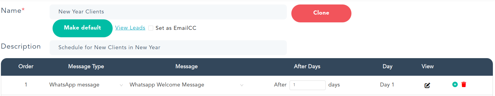

<a name="sequence"/>
## [Sequence](#sequence)
`Schedule Sequence` helps you decide how you want the assistant to followup. i.e.  
- how many followups
- days between each followups

Assistant comes with two default sequences `Recommended` and `Recommended for Email CC`. 
You can clone from one of these sequences and create a new one, providing an appropriate name and description. 

Leads from different geographies would need different followups. for e.g. it may be OK to followup 7 times for leads in Americas but for Europe we recommend not more than 4 times. Custom sequence gives you the ability to pick the number of followups and the days between each appropriately, along with the messages to be sent on each followup.   

You may want to create a custom message for your first email. We recommend to use the tone based generated emails for the followup as they are short and to the point.  
The followup emails will continue to retain the first email to keep the context, having short emails for followups is recommended if you intend to write your own followup messages too.

To create or use an existing custom message you can select the `Message Type` as `Custom message` for that particular followup. Then select an existing message of `Create New` for the Message column.  
While creating or editing a message you can add more followups or reduce by deleting the followup rows. 

Please note that any change the existing sequence would take effect for the leads it is used for.

Sequence is accessible to other users in the org to use, they cannot edit it though. 

If you want to delete a specific sequence, you have to click on the delete icon which comes up on hover of the specific sequence in the sequence drop down list. System provided sequences cannot be deleted, so the delete icon will not come in front of them.

## [Whatsapp Sequence](#whatsapp-sequence)
For Quick Followsup & Reply Cycle you can now use Whatsapp Messages in Sequences.

**Prerequisite :** Before you start to use Whatsapp Sequence you need to have [Sinch Account](https://www.sinch.com/). **Sinch** will act as Whatapp Provider while sending messages.

You can create new custom messages for Whatsapp using steps mentioned [here](../../manage-org/whatsapp-message/)

Once Custom Messages are created You can select desired message from Edit Sequences page as in below image

## Questions answered
- How do I add my custom sequence with custom message ?
- How many follow ups should I use ?
- How can we delete sequences ?
- If I change a in use sequence for number of followups or custom messages will it effect existing leads?
- Can I use sequence created by my team member ? 