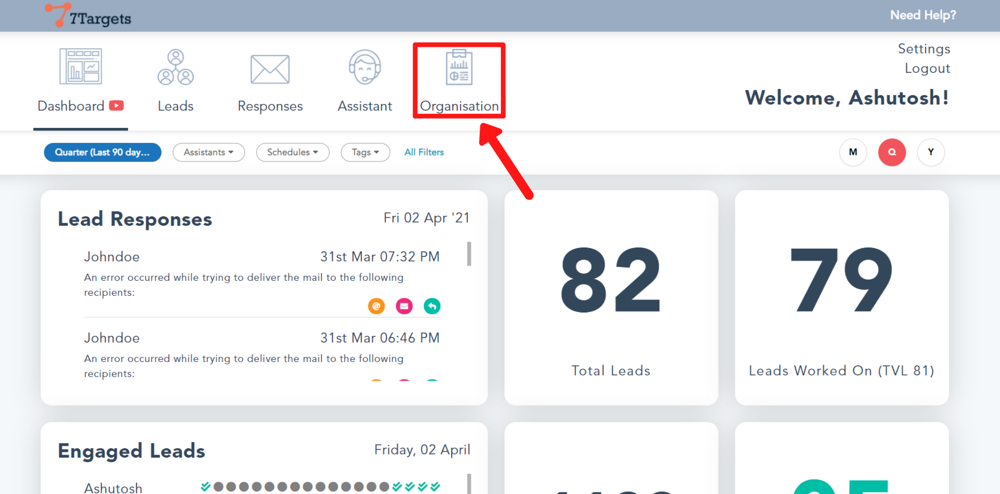
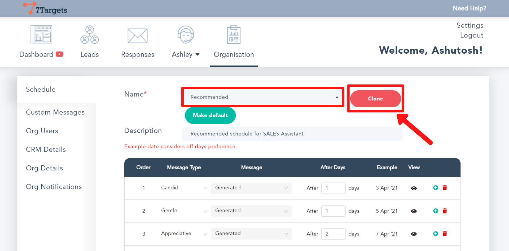
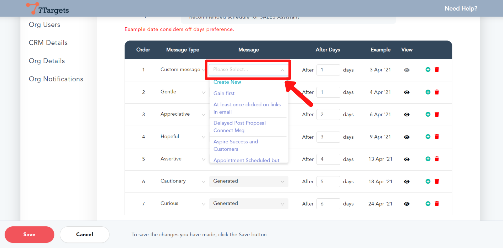
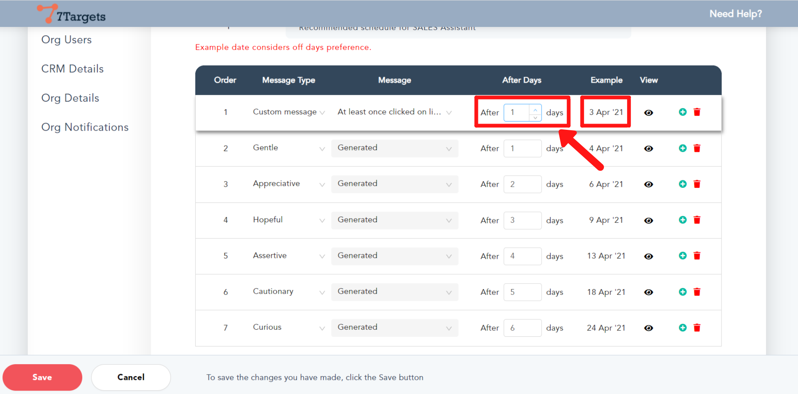
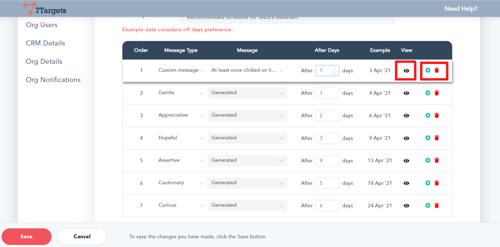
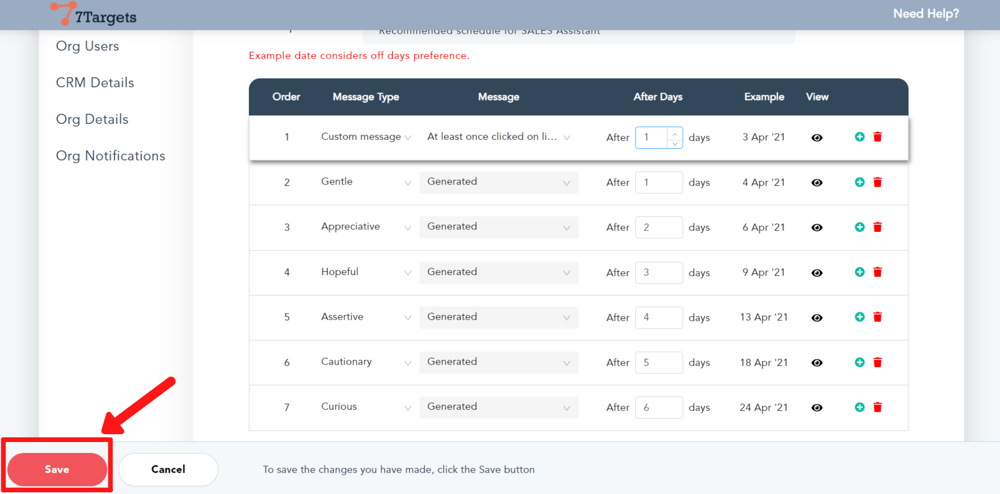
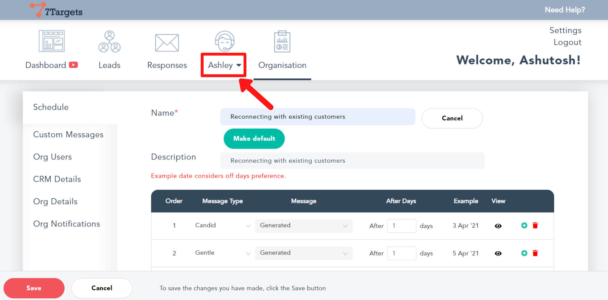
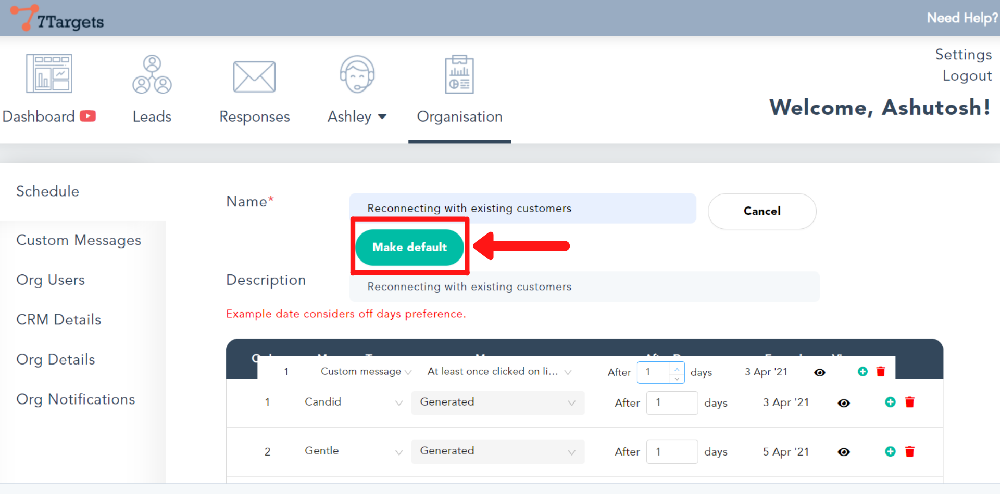

Sequence helps you decide how you want the assistant to followup. i.e.

**-** how many followups  
**-** days between each followup  
**-** what should be the email content  
**-** what should be the email subject  

System comes with two default sequences **Recommended** and **Recommended for Email CC**. 
You can clone from one of these sequences and create a new one, providing an appropriate name and description. 

To know more about scheduling please visit this page.

Follow these simple steps to create a new sequence.

## Step 1

Sign in to your account.

Click on the 'Organisation' Tab. The Sequence sub-tab is selected.

## Step 2

You can select from one of the already available sequences that you can clone.
After cloning you can make all the desired changes to it.

To select the sequence, click on the 'Name' field. Type "Recommended" to select that sequence. 

If you want to clone from some other Sequence then search the desired sequence and select it.

Now click the 'Clone' button.

## Step 3

Give a new name for the sequence that you are creating and add a small description.

## Step 4

Now, in the table, click on the drop down-arrow as shown and select the type of message. Typically we recommend creating the first message in the sequence as a Custom Message.

## Step 5

From the Message column, you can create a new or select from an existing custom message.

## Step 6

Now, change the 'After Days' value so that the message will be sent after the selected number of days. While you change this value, watch the example Date you are getting on the right side.

## Step 7

You can click on the 'View' icon to see the message.

On the right side, you can click on the add and delete icons on any of the rows to add a new message or delete one depending on how many messages you want to have in a sequence. 

## Step 8

Click on the 'Save' button at the left bottom corner after you have made all the changes to the sequence. 

## EmailCC Type
Note that the sequence can be identified as EmailCC Type of sequence. 

EmailCC is a special type, which conveys that the first message is to be skipped and followup starts from 2nd message. As first message is representative of the original message from the user.

[How to assign lead using EmailCC](../how-to/how-to-assign-a-lead-to-AI-assistant-using-EmailCC-feature/).

## Step 9

After saving the sequence you may want to mark it default for the selected/specific Assistant. So that when you add leads for this assistant the default sequence is selected.

Click on the drop-down arrow as shown. Select the AI assistant you want to assign the new sequence to.

Now, click the 'Make default' button.

The custom sequence gives you the ability to pick the number of followups and the days between each appropriately, along with the messages to be sent on each followup.

If you have any further doubts you can directly mail us at info@7targets.com.