After you have setup the AI assistant, you can add further details to her such as signature, context, default schedule, brochure URL, etc.

If you haven't yet setup an assistant, do follow the steps under [how to setup an AI sales assistant](https://help.7targets.ai/how-to-setup-ai-sales-assistant/).

To know more about the details of the assistant please visit this page.

Here is a small video explaining the steps.

    <iframe src="https://www.youtube.com/embed/ELaE7f0mi4A" height="380" width="560" 
    allow="autoplay; encrypted-media"
    frameborder="0">
    </iframe>

Follow the steps below to add details to the AI sales assistant.

## Step 1

Sign in to your account. 

Click on the 'Assistant' tab.

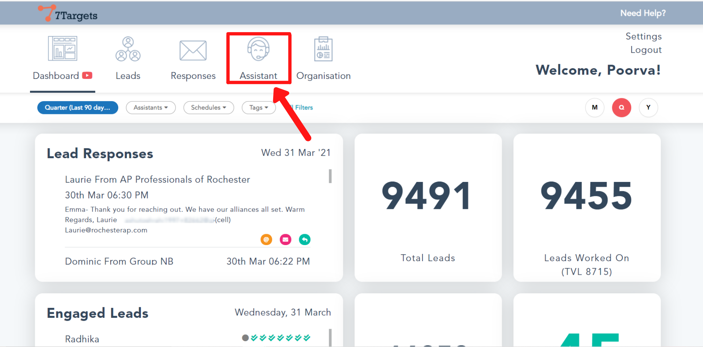

## Step 2

Select the 'Edit Assistant' option as shown.

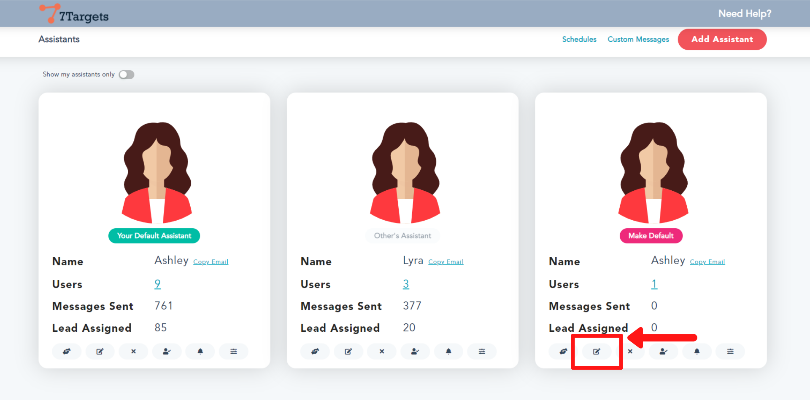

## Step 3

In the 'Name' field you can change the name of the assistant. Check that it changes the email id of the assistant too.

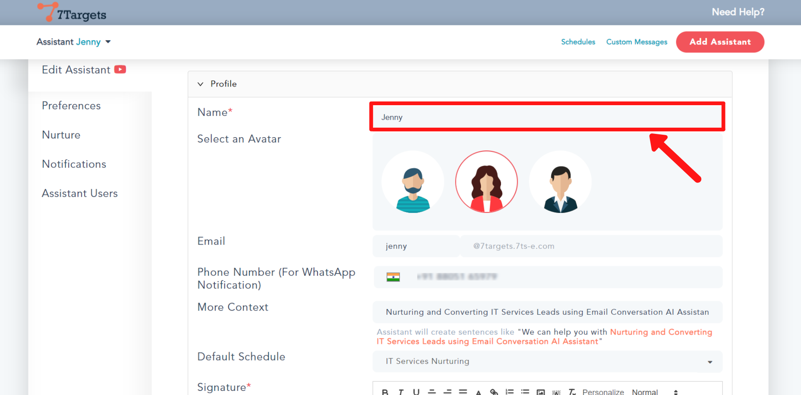

## Step 4

You can change the avatar of the assistant by selecting one of the three.

## Step 5

In the 'Email' field you can edit the email address of the assistant.

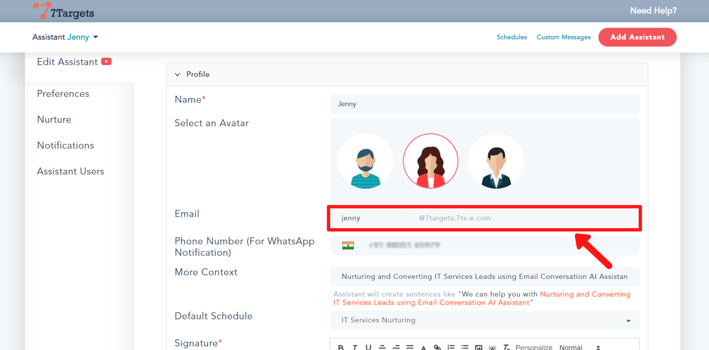

## Step 6

To get WhatsApp notifications, you can add the phone number in the field shown below. Make sure you mention the country code.

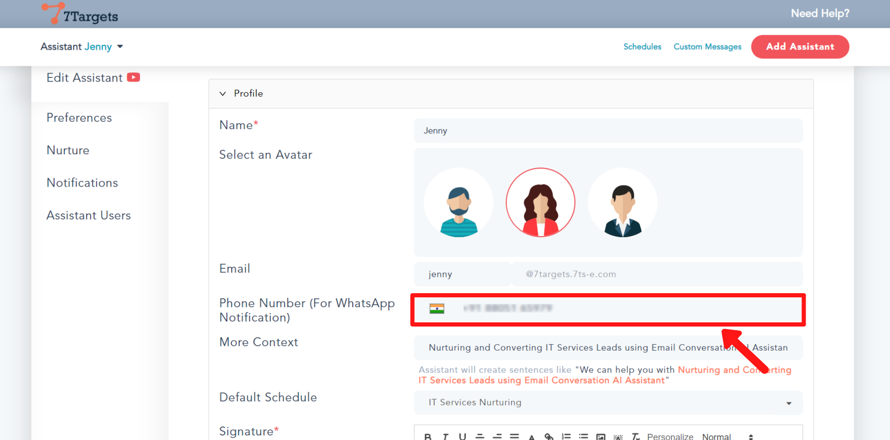

## Step 7

This is a very IMPORTANT setting. This is used in outgoing emails, hence be very careful while you set the value here. The assistant will build a sentence around a topic (such as one of your offerings). You add the topic in the ‘More Context’ field. Please read the sample sentences created just below the box before you finalize the value of this field.

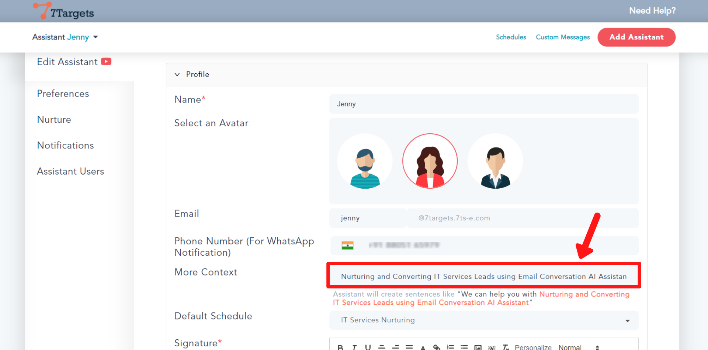

## Step 8

You can assign the default schedule to the assistant. Click on the drop-down arrow and select the desired schedule. If you assign leads to the assistant and do not mention which schedule to use, the assistant will use this default schedule to email the leads. 

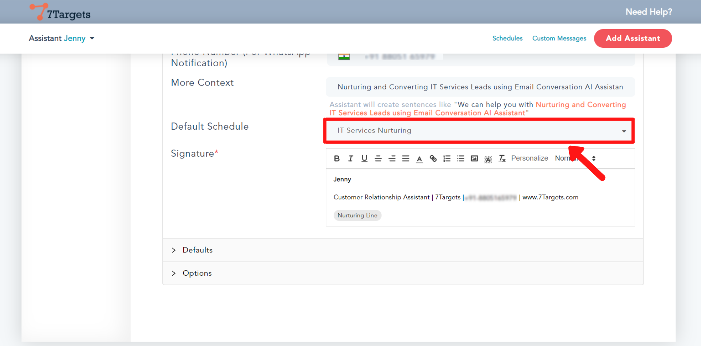

You can even create your own schedule. Follow the steps under [how to make your own schedule](https://help.7targets.ai/how-to-schedule-followups/).

## Step 9

In the ‘Signature’ field, you can edit the signature of the assistant. Click here to see different signature templates and how you can personalize the signature, and how the 'Nurturing Line' populated in the signature. 

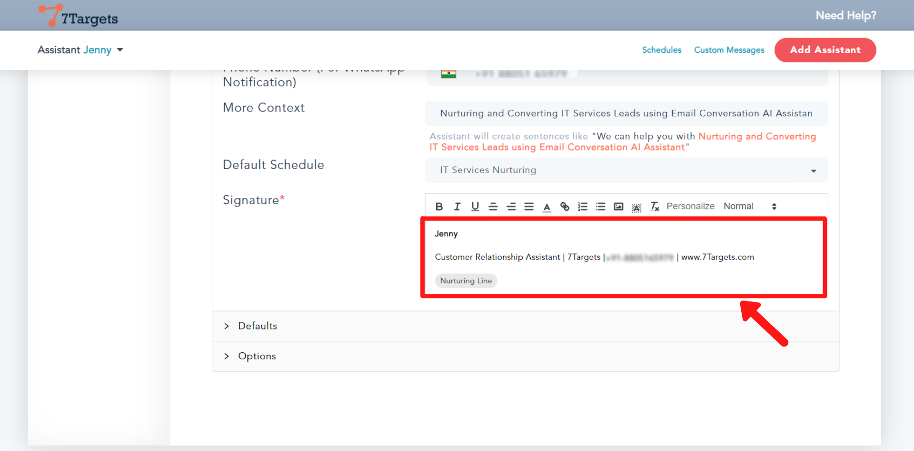

## Step 10

Now, click on the 'Default' option.

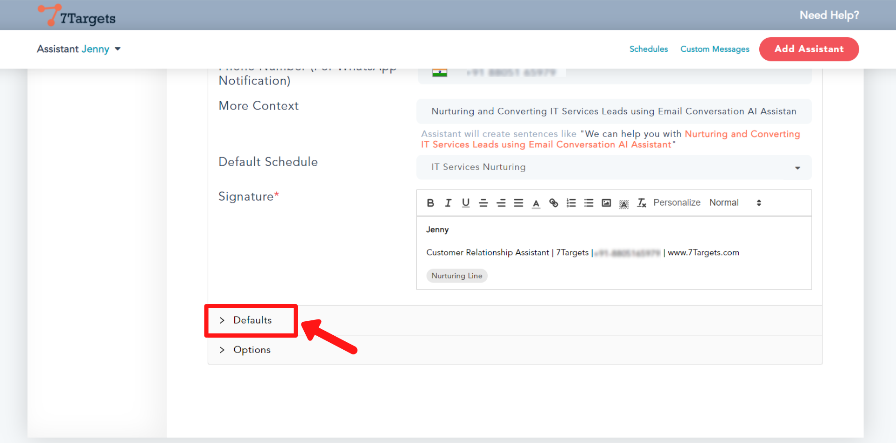

## Step 11

Default EmailCC Schedule is used by the assistant when the assistant is copied in the email by the user with the lead. For EmailCC schedule, the  assistant will start the with the second message in the sequence. Your email where you Cc’ed/Copied the assistant is considered as the first email.

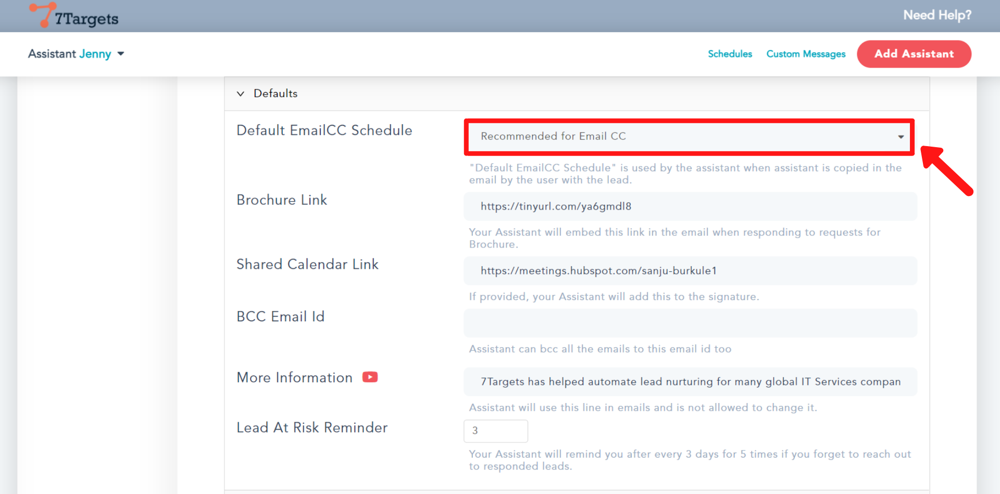

## Step 12

If you have a brochure, add the link here. Whenever any lead asks for a brochure, the assistant will send this brochure to him/her. Make sure that the brochure link is accessible from anywhere. The brochure is NOT ATTACHED to the email, just the link to the brochure is sent.  

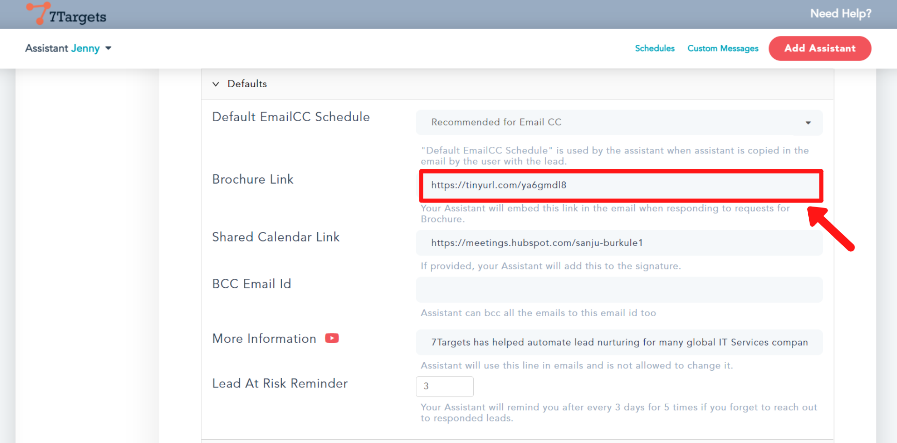

## Step 13

If you want to add the link of your meeting calendar to the signature, add the calendar link in this field. Here is how you can setup Calendly and Hubspot meeting links, which makes it easy for leads to choose a meeting time with you. 

## Step 14

In the 'BCC Email Id' field, you can add the email id you want to bcc to.

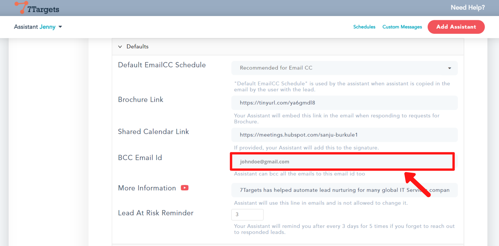

## Step 15

Auto-generated follow-up emails are short and quick. Sometimes you may want to add an additional line in these follow-up emails just before the Call To Action statement. That's when you can use this ‘More Information’ field. Write a complete sentence in this field. It will be added like a paragraph just before the CTA in many follow-up emails automatically by the assistant. 

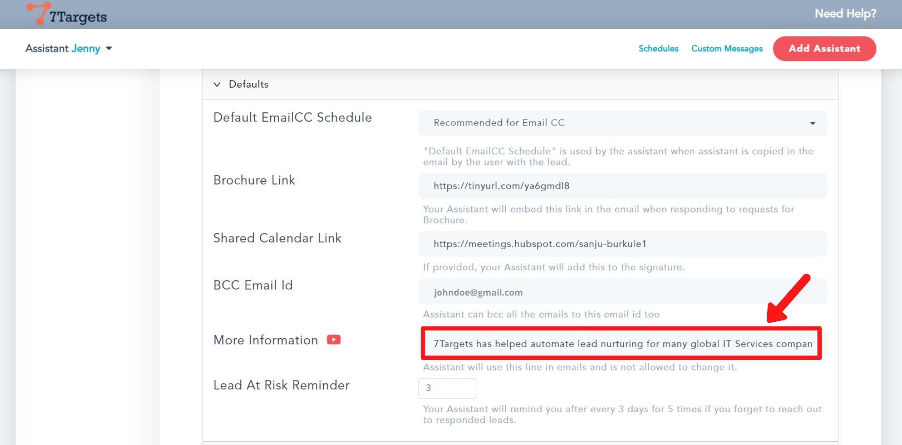

## Step 16

Whenever you forget to respond to a lead, the assistant reminds you. Here, you can set the number of days after which you would like to get reminded. For example here the number is set to 3. The assistant will remind you after every 3 days

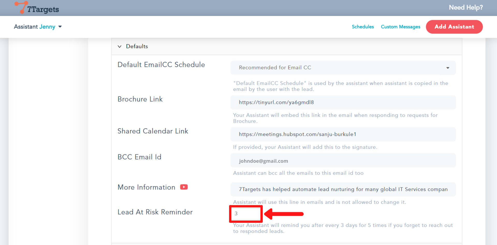

## Step 17

After making all the changes, click on the 'Save' button.

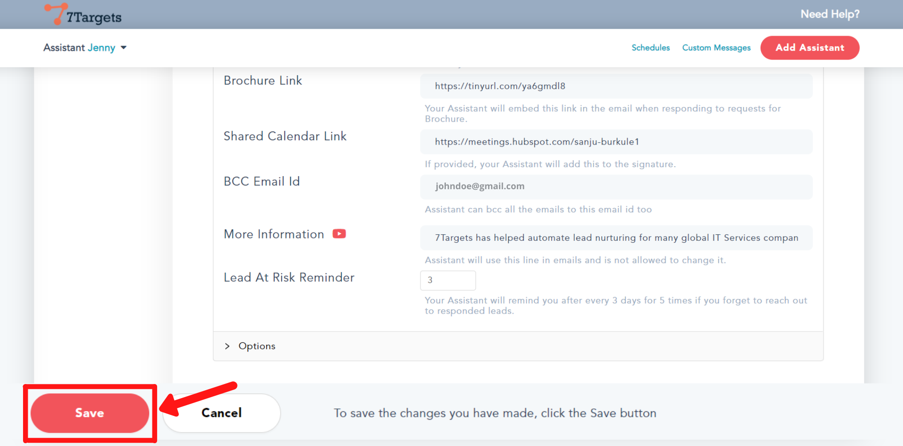

If you have any further doubts you can directly mail us at info@7targets.com.