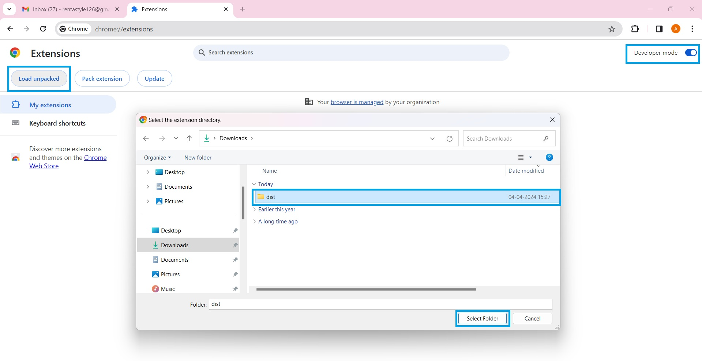
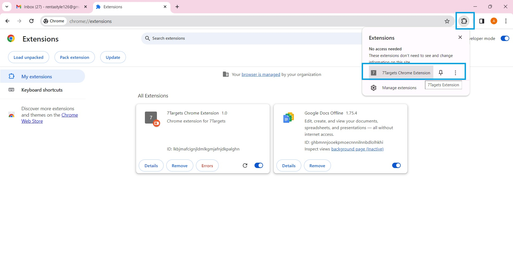
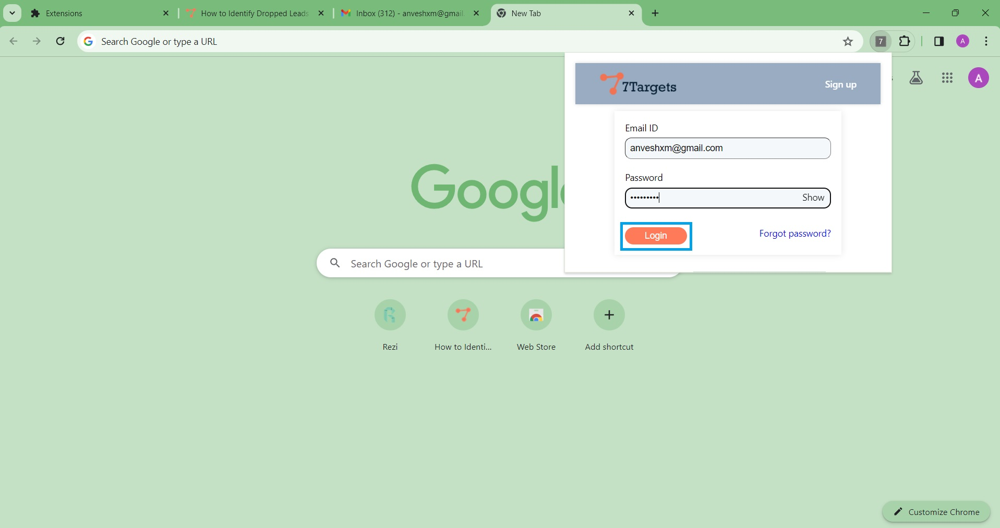
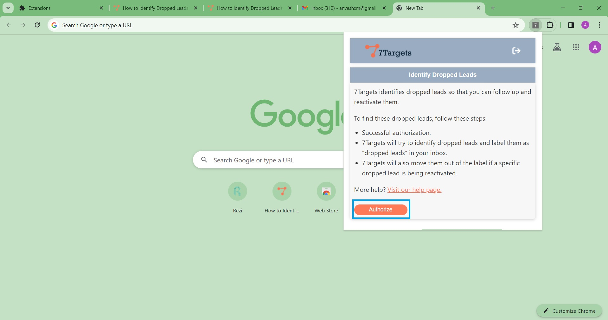
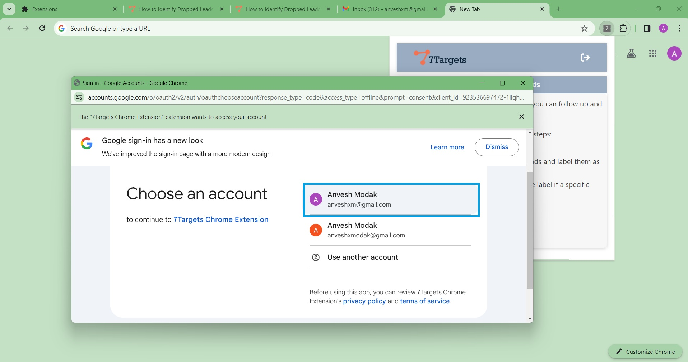
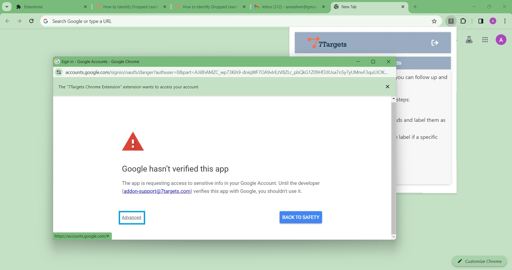
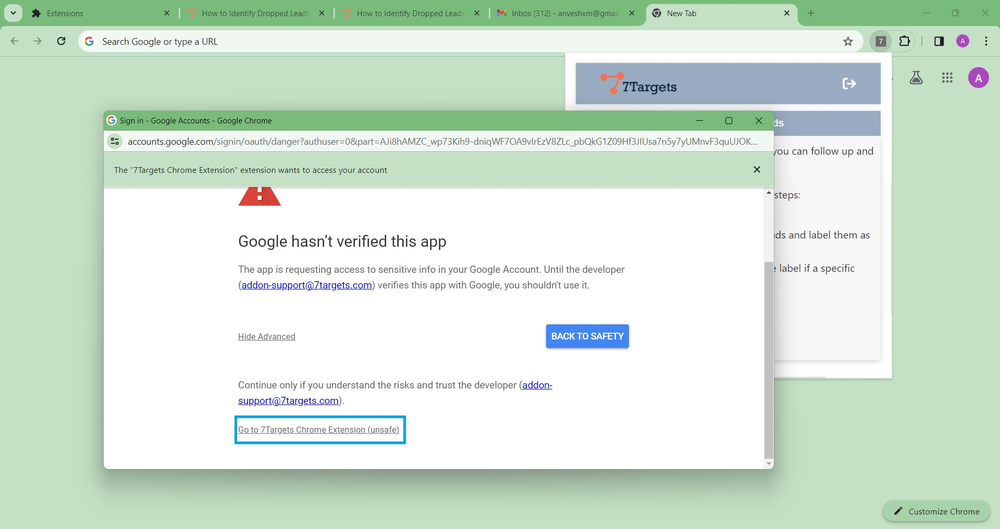
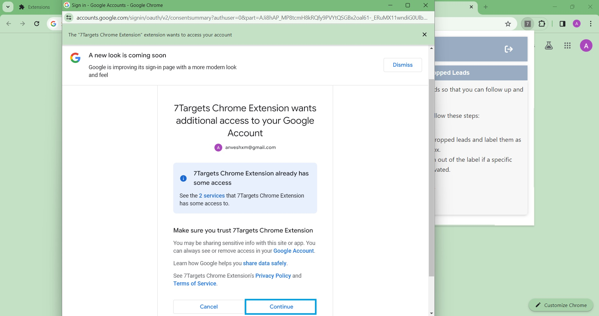
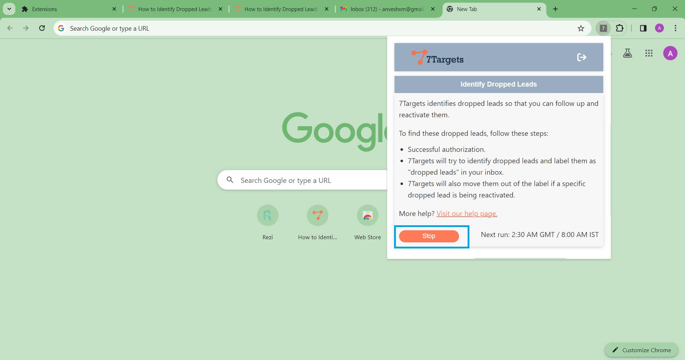
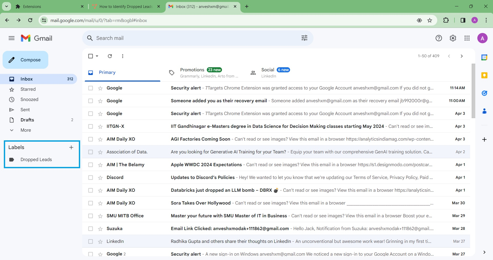

## Overview
Learn to efficiently identify dropped leads using the 7Targets Chrome Extension within Gmail. Discover how to spot potential customers who've lost interest and reactivate them. This tutorial guides you through authorizing the extension, identifying dropped leads, and reviving them for increased sales. Unlock the power of the 7Targets dropped leads Extension to boost your lead management and business growth.

## Installing the Extension
To get started with the 7Targets Chrome Extension, follow these simple steps:

1. Visit the Chrome Web Store and search for "7Targets Dropped Leads Extension" or download it from [this link](https://drive.google.com/file/d/1VFtkfXRdOk0yxZ5GcWcLynKF0MJLbstT/view?usp=drive_link).

2. Once you've found the extension, click on the "Add to Chrome" button to start the installation process.

3. A pop-up window will appear asking you to confirm the installation. Click on "Add Extension" to proceed.

If you're installing the extension using a zip file, navigate to "Manage Extensions" in Chrome, then click on "Load unpacked" and select the extracted folder containing the extension files.

4. The extension will be downloaded and installed automatically. Once completed, you'll see a confirmation message.

5.Look for the 7Targets icon in your Chrome browser toolbar to confirm that the extension has been successfully installed.

Now that you've installed the 7Targets Chrome Extension, you're ready to proceed with Gmail authorization and identifying dropped leads.

## Gmail Authorization

To start using the 7Targets Chrome Extension, you'll need to log in with your 7Targets account. Here's how you can get started:

1. If you do not have a 7Targets account, click on the "Sign Up" button to create an account on the 7Targets website. After creating your account, log in using your 7Targets credentials in the Dropped Lead extension.

2. After logging into extension, click on "Authorize" button. This will prompt you to grant permission for the extension to access your Gmail account.

3. Select the account that you used to log into the dropped leads extension.

4. Click on "Advanced," then click on "Go to 7Targets Chrome Extension."

5. Follow the on-screen instructions to grant the necessary permissions.

6. Once the authorization process is complete, you'll receive a notification confirming that authorization was successful. The identification of dropped leads will run for the first time after authorization.

With the 7Targets Chrome Extension authorized, it can now effectively identify dropped leads in your Gmail, and then you can take proactive steps to reactivate them, boosting your sales and business growth.

## Dropped Lead Identification

Once you've authorized the 7Targets Chrome Extension and ensured it has access to your logged-in Gmail account, you can identify dropped leads. Here's how:

1. The extension will automatically analyze your sent emails every day at 10:30 AM GMT (4:00 PM IST) to identify dropped leads.

2. Dropped leads will be labeled as "Dropped Leads" for easy identification.

3. All identified dropped leads will be moved into the designated label in your Gmail account.

4. Review the labeled emails to identify dropped leads, then take proactive steps to reactivate them.

By efficiently identifying and reactivating dropped leads, you can boost your sales efforts and business growth.

<!-- ## Managing Dropped Leads and Reactivations -->